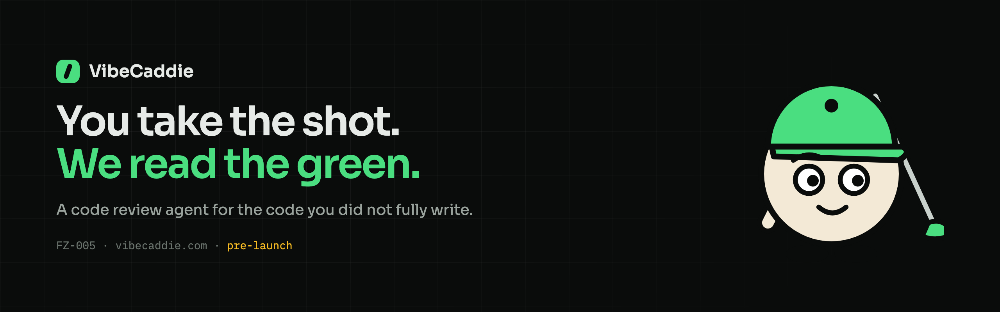

<p align="center">
  
</p>

<p align="center">
  
  
  
  
  
  
  
</p>

<p align="center">
  <b>vibecaddie.com</b> &middot; FZ-005
</p>

---

# The product

VibeCaddie is a code review agent for the code you did not fully write.

> **You take the shot. We read the green.**
> AI tools made it easy to produce working code fast. They did not make it easy
> to know whether that code is safe to ship.

You point it at a repository. It reads the code, works out what kind of
codebase it is, loads only the **review skills** that apply to it, and returns
findings ranked by severity: the file, the line, what is wrong, why it matters,
and the change that would fix it.

Selection is the point. A scanner that runs every rule against every repository
is how you get four hundred findings and no signal. A Stripe integration gets
the webhook skill. A CLI with no network surface does not.

### Access model

| | |
| :--- | :--- |
| Access requested | **Read-only.** It never needs write access and will not ask |
| Writes code | No |
| Opens pull requests | No |
| What is stored | The report: findings, paths, line numbers, short excerpts |
| What is not stored | A copy of your repository |
| Training | Your code is never used to train a model |

### Pricing

Prepaid credits, no subscription. **One run is 12 credits** whatever the size of
the repository, so the next pass never costs more than the last one.

| Pack | Price | Credits | Runs | Per run |
| :--- | :--- | :--- | :--- | :--- |
| Starter | **$15** | 60 | 5 | $3.00 |
| Regular | **$60** | 300 | 25 | $2.40 |
| Heavy | **$180** | 1,200 | 100 | $1.80 |

---

# Status

**Nothing has shipped.** This repository is a pre-launch website, and the site
says so on every page it could possibly mislead someone on.

- The **GitHub app is not built and not listed.** There is no install link
  pretending there is one.
- **No audit has ever run.** The report on the site is a hand-written sample and
  is labelled as one.
- **No credits can be bought.** The prices above are planned, not live. There is
  no checkout and no account.
- No usage, customer or revenue figures appear anywhere. If you find one, it is
  a bug: open an issue.
- The early-access form is the only real transaction, and it only delivers once
  a mail provider is connected (see [Secrets](#secrets-not-set-yet)).

`window.VC.status` in [`assets/vc-data.js`](assets/vc-data.js) is the single
switch. Every claim on the site is gated on it, so flipping a flag there and
regenerating is the only way a page starts saying "live".

---

# Honesty notes on the design source

The site was built from a Claude Design project. Five things in that prototype
would have been dishonest shipped as-is, and were deliberately not reproduced:

| Prototype | What shipped instead |
| :--- | :--- |
| **"Install on GitHub"** buttons linking to a listing | The app does not exist. An **early-access form** that posts to a real endpoint, and reports failure honestly when it cannot deliver |
| **"Audit #14 · acme/checkout · 3f9c2e1"**, "42 files", "done in 1m 48s" | The report UI is the best explanation of the product, so it stayed, marked **`Sample · illustrative, no audit has run`** in the page and in `llms.txt` |
| **"Buy 60 credits"** / **"Buy 300 credits"** buttons | Nothing can be bought. The packs render as **planned pricing** with a `Not on sale yet` label where the button was |
| A **"most people"** badge on the Regular pack | Removed. Nobody has bought anything, so nothing is what most people do |
| **Docs** and **Changelog** links in the nav and footer | Removed until they exist. The site ships no link to a page that 404s |

The five findings in the sample report (a session token read from a query
string, an unverified Stripe webhook, a raw error object returned to a client,
an email logged at info level, an outdated lodash) are kept. They are real
classes of bug used as teaching examples, and they are what makes the report
legible. `llms.txt` states plainly that they are illustrative and that
`acme/checkout` does not exist.

The prototype also had no privacy page. A tool that reads your source code owes
you a straight answer about what it keeps, so
[one was written](privacy/index.html) and linked from the main nav.

---

# The site

| Page | What it carries |
| :--- | :--- |
| [`/`](index.html) | Hero, the problem, how it works, the sample report, skills, the loop, credits, FAQ |
| [`/how-it-works/`](how-it-works/index.html) | The three steps in depth, and what a run does in order |
| [`/skills/`](skills/index.html) | All twelve review skills, what each looks for, how selection works |
| [`/pricing/`](pricing/index.html) | The credit model, the packs, why not a subscription, billing FAQ |
| [`/privacy/`](privacy/index.html) | Exactly what is read, what is stored, and what is never done |

Directory-style URLs, static HTML, no client-side routing. Every word on every
page is in the HTML, so a crawler with JavaScript disabled reads the same site a
person does. JavaScript only adds the nav toggle, the scroll reveal, the
terminal and skill animations, and the form.

---

# Agent-readable layer

Answer engines are a first-class audience here, not an afterthought.

| Surface | Purpose |
| :--- | :--- |
| [`llms.txt`](llms.txt) | Plain-text brief for language models. **Leads with the pre-launch status** so a model cannot summarise this as a shipped product |
| [`vibecaddie.json`](vibecaddie.json) | The same facts as JSON: status, the credit model, all twelve skills, the privacy commitments, every FAQ. Served `Access-Control-Allow-Origin: *` |
| JSON-LD | `Organization`, `WebSite`, `SoftwareApplication`, three `Offer`s, `FAQPage`, `BreadcrumbList`. **No `aggregateRating` and no reviews** — nothing has shipped, so there is nothing to rate. Offers are `PreOrder` until `status.creditsSold` flips |
| [`robots.txt`](robots.txt) | GPTBot, ClaudeBot, PerplexityBot, Applebot, Google-Extended and friends explicitly allowed |
| `<link rel="alternate">` | Both machine surfaces announced in every page head |

All of it is generated by `tools/pages.js` from the same data as the pages, so
they cannot drift from what a human reads.

---

# Repo layout

```
vibecaddie/
├── index.html              generated — do not hand-edit
├── how-it-works/  skills/  pricing/  privacy/
├── 404.html  sitemap.xml  llms.txt  vibecaddie.json    generated
├── robots.txt  _headers  _redirects  site.webmanifest
├── assets/
│   ├── vc.css              one stylesheet, token-driven
│   ├── vc-data.js          ← the single source of truth
│   ├── vc-common.js        nav, reveal, terminal, skills, loop, form
│   ├── favicon.svg         the club-through-plate mark
│   ├── caddie-*.svg        the four mascot poses, lifted from the design source
│   └── og*.png  icon-512.png  apple-touch-icon.png  readme-banner.png
├── functions/api/
│   └── early-access.js     POST, 503 not_configured until secrets are set
└── tools/
    ├── pages.js            generates every page, sitemap, llms.txt, vibecaddie.json
    ├── build-dist.sh       allowlist + content-hash stamping
    ├── render-og.sh        headless Chrome → every raster asset
    ├── og-render.html      the OG card template
    └── banner-render.html  the README banner template
```

---

# Working on it

No package manager, no dependencies, no build step for development.

```bash
node tools/pages.js          # regenerate every page from assets/vc-data.js
python3 -m http.server 8793  # then open http://localhost:8793
```

**Edit [`assets/vc-data.js`](assets/vc-data.js), then run `node tools/pages.js`.**
The HTML files are generated output; editing them directly means your change is
gone on the next build.

```bash
./tools/render-og.sh         # regenerate OG cards, banner and icons (needs Chrome)
./tools/build-dist.sh        # assemble dist/ exactly as it should be served
```

`render-og.sh` uses headless Chrome because ImageMagick cannot rasterize these
correctly: CSS gradients, webfonts and SVG transforms all have to render. Note
that Chrome refuses window widths under roughly 500px, so anything narrower is
rendered large and downscaled rather than shot directly.

`build-dist.sh` works from an explicit allowlist and refuses to finish if the
design source, the design runtime or the build brief ever reach `dist/`.

---

# Design

The palette and type come from the Claude Design source and are unchanged.

| Token | | Use |
| :--- | :--- | :--- |
| `--bg` | `#0a0c0b` | The page |
| `--panel` | `#0e100f` | Cards |
| `--panel-2` | `#101312` | The terminal |
| `--band` | `#0d0f0e` | Alternating sections |
| `--ink` | `#e6eae7` | Body text |
| `--muted` | `#9aa39d` | Secondary text |
| `--dim` | `#6b746e` | Labels and meta |
| `--green` | `#4ade80` | The accent |
| `--critical` | `#fb7185` | Critical findings |
| `--warning` | `#fbbf24` | Warnings, and the pre-launch marker |
| `--cream` | `#f3e9d6` | The caddie |

Sora for display and text, IBM Plex Mono for labels, code and numbers. Every
animation is behind `prefers-reduced-motion`.

---

# Deploying

Cloudflare Pages, project `vibecaddie`, on the Kontinuum account.

```bash
./tools/build-dist.sh
npx wrangler pages deploy dist --project-name=vibecaddie --branch main
```

Run it from the repo root: `functions/` is discovered next to the working
directory, and deploying from anywhere else publishes the pages with no
Functions bundle, so `/api/early-access` would 404 while the site still looked
fine. The deploy log line to check for is `Uploading Functions bundle`.

`_headers` caches `/assets/*.css` and `*.js` immutably, which is only safe
because `build-dist.sh` stamps every reference with a content hash. SVG and PNG
filenames are not hashed, so those are capped at a day and a week respectively.

### Secrets not set yet

The early-access form answers `503 not_configured` until these are Pages
secrets, and the page says so and shows the direct address rather than
pretending to have sent:

| Secret | For |
| :--- | :--- |
| `RESEND_API_KEY` | Sending at all |
| `EARLY_ACCESS_TO` | Inbox that receives signups |
| `EARLY_ACCESS_FROM` | Optional. Defaults to `onboarding@resend.dev` |
| `TURNSTILE_SECRET` | Optional. Verifies a Turnstile token if present |

Secrets bind at deploy time, so redeploy after setting them or the function
keeps returning its not-configured branch.

---

<p align="center">
  <sub>
    <b>FZ-005</b> &middot; a <a href="https://factory0.ventures">Factory Zero</a> venture &middot;
    <a href="mailto:contact@vibecaddie.com">contact@vibecaddie.com</a>
  </sub>
</p>
